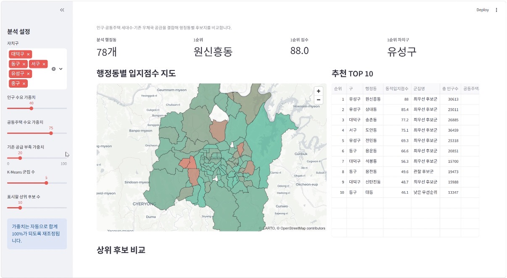
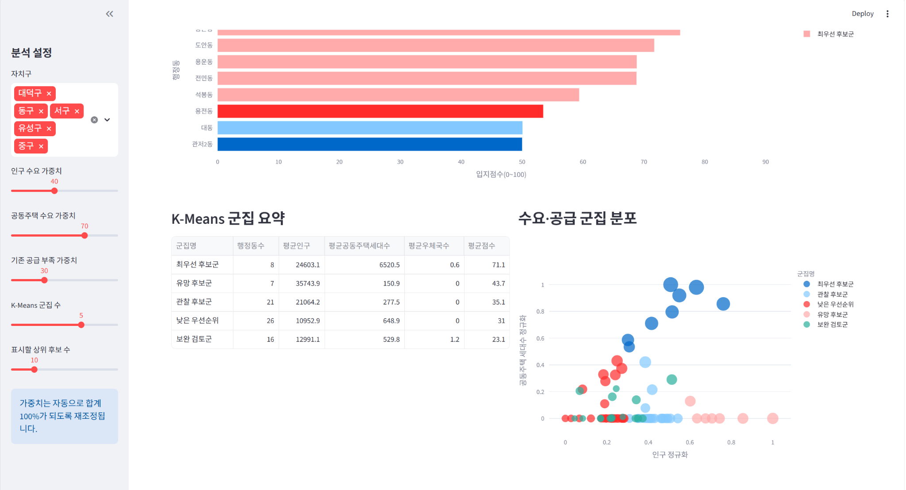
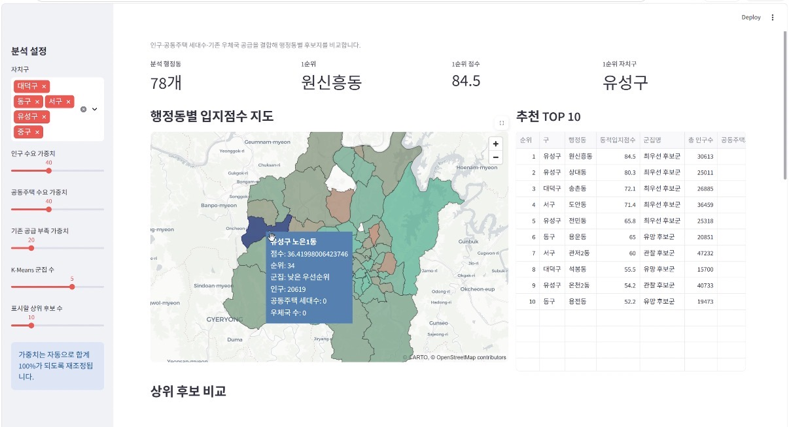
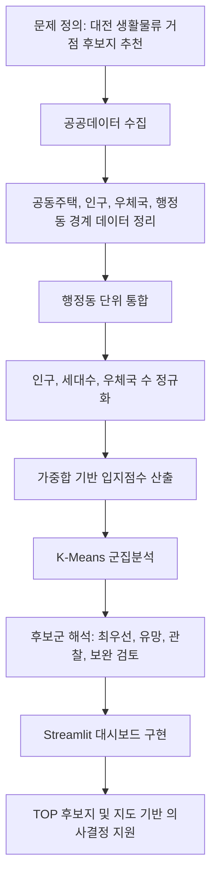
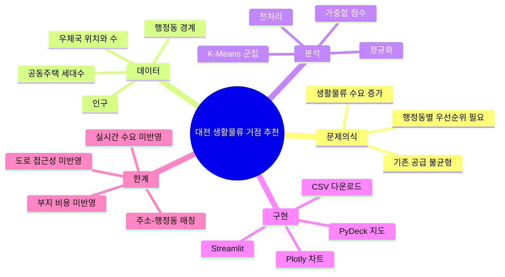

# 대전 물류데이터 AI 활용 및 분석 아이디어 공모전

## AI 기반 대전 생활물류 거점 입지 추천 시스템

대전광역시 행정동 단위의 인구, 공동주택 세대수, 우체국 공급 현황을 결합해 생활물류 거점 후보지를 비교하고 추천하는 데이터 분석 프로젝트입니다.  
산업공학 관점에서 물류 네트워크 설계, 수요-공급 불균형, 시설 입지 의사결정 문제를 공공데이터 기반 대시보드로 구현했습니다.



## 프로젝트 목표

생활물류 거점은 단순히 사람이 많은 곳이 아니라, 물류 수요가 높고 기존 공급이 부족하며 운영 관점에서 우선순위를 설명할 수 있는 곳이어야 합니다.  
이 프로젝트는 행정동별 데이터를 통합해 후보지를 점수화하고, K-Means 군집분석으로 후보군의 성격을 나누어 의사결정자가 빠르게 비교할 수 있도록 만드는 것을 목표로 했습니다.

## 주요 결과 화면

| 가중치 조절 및 군집 분석 | 지도 팝업 상세 확인 |
| --- | --- |
|  |  |

## 핵심 기능

- 행정동별 생활물류 입지점수 산출
- 인구 수요, 공동주택 수요, 기존 공급 부족 가중치 조절
- 대전 행정동 경계 기반 지도 시각화
- 추천 TOP N 후보지 자동 정렬
- K-Means 기반 후보군 분류
- 후보지별 인구, 공동주택 세대수, 우체국 수 확인
- 현재 분석 결과 CSV 다운로드

## 기술 스택

| 구분 | 사용 기술 | 역할 |
| --- | --- | --- |
| 데이터 처리 | Python, pandas, numpy | CSV/Excel 통합, 컬럼 정리, 결측 처리, 정규화 |
| 공간 분석 | GeoPandas, Shapely, Pyogrio | 행정동 경계 데이터 처리, GeoJSON 생성 |
| 머신러닝 | scikit-learn, KMeans, StandardScaler | 수요-공급 특성 기반 군집분석 |
| 시각화 | Streamlit, PyDeck, Plotly | 대시보드, 지도, 막대그래프, 산점도 구현 |
| 산업공학 방법론 | 입지분석, 다기준 의사결정, 수요-공급 균형 분석 | 후보지 우선순위 산정 논리 구성 |

## 산업공학 관점에서 사용한 개념

- 시설 입지 문제: 제한된 물류 자원을 어느 행정동에 우선 배치할지 판단
- 수요-공급 균형: 인구와 공동주택 세대수를 수요 proxy로, 우체국 수를 기존 공급 proxy로 활용
- 다기준 의사결정: 여러 지표를 정규화하고 가중합으로 비교 가능한 점수 생성
- 물류 네트워크 설계: 생활권 단위의 거점 후보를 찾는 의사결정 지원 구조 설계
- 군집분석: 비슷한 수요-공급 패턴을 가진 행정동을 후보군으로 분류
- 데이터 기반 DSS: Streamlit 대시보드로 사용자가 가중치를 바꾸며 시나리오를 비교

## 분석 흐름



## 마인드맵



## 실행 방법

```bash
python -m venv .venv
.venv\Scripts\activate
pip install -r requirements.txt
streamlit run src/streamlit_app.py
```

K-Means 결과 파일을 다시 생성하려면:

```bash
python src/kmeans_analysis.py
```

## 데이터 공개 원칙

이 저장소는 public repo 운영을 고려해 원본 대용량 데이터(`data/raw/`)를 포함하지 않습니다.  
대신 앱 실행과 결과 확인에 필요한 정제 데이터(`data/processed/`)와 데이터 출처 문서를 제공합니다.

- 원본 데이터는 각 제공기관의 공공데이터 페이지에서 직접 내려받아야 합니다.
- 데이터별 제공기관, 기준일, 원본 링크, 이용조건은 [docs/DATA_SOURCES.md](docs/DATA_SOURCES.md)에 정리했습니다.
- 원본 데이터의 저작권과 이용조건은 각 제공기관의 고지 내용을 따릅니다.
- 이 프로젝트는 공공데이터를 이용한 분석 사례이며, 제공기관이 프로젝트를 후원하거나 결과를 보증한다는 의미가 아닙니다.

## 분석하면서 막혔던 점

- 공공데이터마다 인코딩이 달라 `cp949`, `utf-8`, `utf-8-sig`, `euc-kr`을 자동 시도하는 로직이 필요했습니다.
- 구별 공동주택 데이터의 컬럼명이 달라 하나의 표준 스키마로 맞추는 전처리가 필요했습니다.
- 주소만으로 행정동을 매칭하는 과정에서 일부 공동주택이 정확히 매칭되지 않아 공동주택 지표가 과소 추정될 수 있었습니다.
- 행정동 경계 파일은 용량이 크고 shp 구성 파일이 많아 public repo에 원본을 넣기 부적합했습니다.
- GeoDataFrame의 좌표계가 섞이면 지도 표시가 어긋날 수 있어 `EPSG:4326` 변환을 확인했습니다.
- K-Means 군집 번호는 의미가 없기 때문에 평균 점수를 기준으로 `최우선 후보군`, `유망 후보군`처럼 해석 가능한 이름을 다시 붙였습니다.
- Streamlit 앱에서는 사용자가 가중치를 바꿀 때마다 점수와 군집이 재계산되므로, 가중치 합이 자동으로 100%가 되도록 보정했습니다.

## 좋았던 점

- 공공데이터만으로도 행정동별 생활물류 수요와 공급 부족을 비교할 수 있는 최소한의 의사결정 구조를 만들 수 있었습니다.
- 단순 순위표가 아니라 지도, TOP 후보, 군집 요약, 산점도를 함께 보여주면서 분석 결과를 직관적으로 설명할 수 있었습니다.
- 산업공학에서 배우는 입지 선정, 수요 분석, 다기준 의사결정 개념을 실제 지역 데이터에 연결할 수 있었습니다.
- 가중치를 조절할 수 있게 만들어 하나의 정답이 아니라 여러 정책 시나리오를 비교할 수 있게 했습니다.

## 한계와 개선 방향

| 한계 | 개선 방향 |
| --- | --- |
| 공동주택 주소의 행정동 매칭률 한계 | 주소 정제, 지오코딩, 행정동 코드 매핑 고도화 |
| 택배 수요가 우편번호 또는 행정구역 단위로 제한됨 | 실제 배송량, 유동인구, 상권 데이터 추가 |
| 기존 공급을 우체국 수로만 단순화 | 민간 택배 거점, 편의점 택배, 물류센터 접근성 반영 |
| 운영 비용과 부지 조건 미반영 | 임대료, 토지이용, 도로 접근성, 교통량 데이터 결합 |
| K-Means 군집 수 선택의 주관성 | 실루엣 점수, 엘보우 방법, 다른 군집모델 비교 |

## 폴더 구조

```text
Daejeon_Logistics_Project/
├─ data/
│  └─ processed/                 # 앱 실행용 정제 데이터
├─ docs/
│  ├─ images/                    # README 표시용 결과 이미지
│  ├─ DATA_SOURCES.md            # 데이터 출처 및 공개 원칙
│  └─ PROJECT_REFLECTION.md      # 분석 회고, 문제점, 개선 방향
├─ src/
│  ├─ 01_preprocessing.ipynb     # 전처리 및 EDA 노트북
│  ├─ kmeans_analysis.py         # K-Means 분석 스크립트
│  └─ streamlit_app.py           # Streamlit 대시보드
├─ .gitignore
├─ requirements.txt
└─ README.md
```

## 주의

본 프로젝트는 공모전 아이디어 검증 및 포트폴리오 목적의 분석 결과입니다. 실제 물류 거점 입지 결정에는 부지 확보 가능성, 비용, 도로 접근성, 법적 규제, 민간 물류망, 현장 실사 등이 추가로 검토되어야 합니다.
